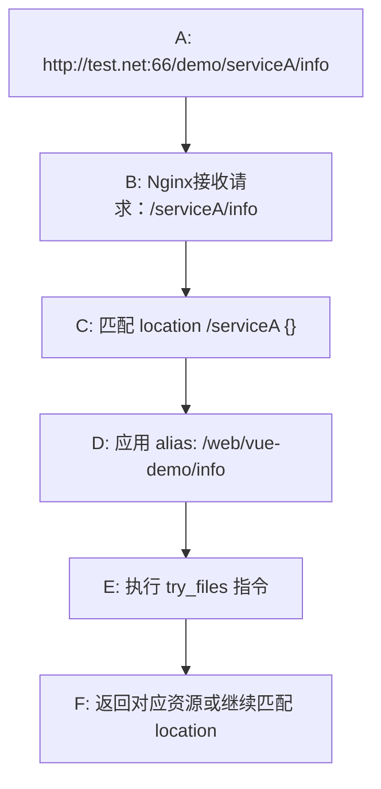

# nginx

## 简介

## 配置示例

```nginx
# Nginx 主配置文件示例
# 通常位于: /usr/local/nginx/conf/nginx.conf

#=============== 全局配置 ===============
# 运行用户
user nginx;

# 自动根据 CPU 核心数设置工作进程数
worker_processes auto;

# 错误日志级别: debug|info|notice|warn|error|crit
error_log /var/log/nginx/error.log warn;

# PID 文件位置
pid /var/run/nginx.pid;

# 单个工作进程最大连接数
events {
    # 事件驱动模型（通常自动选择）
    use epoll;  # Linux 推荐 epoll
    
    # 每个工作进程最大连接数
    worker_connections 10240;
    
    # 是否开启多连接（一次接受所有新连接）
    multi_accept on;
}

#=============== HTTP 配置 ===============
http {
    #=============== 基础配置 ===============
    # 包含 MIME 类型定义
    include /etc/nginx/mime.types;
    
    # 默认 MIME 类型
    default_type application/octet-stream;
    
    # 日志格式定义
    log_format main '$remote_addr - $remote_user [$time_local] "$request" '
                    '$status $body_bytes_sent "$http_referer" '
                    '"$http_user_agent" "$http_x_forwarded_for"';
    
    # 访问日志（关闭可提升性能）
    access_log /var/log/nginx/access.log main buffer=32k flush=5s;
    
    # 错误日志级别
    error_log /var/log/nginx/error.log warn;
    
    #=============== 性能优化 ===============
    # 开启高效文件传输模式
    sendfile on;
    
    # 优化网络传输
    tcp_nopush on;      # 发送头部时优化包数量
    tcp_nodelay on;     # 禁用 Nagle 算法
    
    # 连接超时设置
    keepalive_timeout 65;      # 长连接超时时间
    client_header_timeout 10;  # 读取请求头超时
    client_body_timeout 10;    # 读取请求体超时
    send_timeout 10;           # 发送响应超时
    
    # 请求体大小限制（文件上传）
    client_max_body_size 50M;
    
    # 缓冲区设置
    client_body_buffer_size 128k;
    client_header_buffer_size 4k;
    large_client_header_buffers 4 32k;
    
    # 输出缓冲
    output_buffers 32 32k;
    
    #=============== Gzip 压缩 ===============
    gzip on;                    # 开启 gzip 压缩
    gzip_vary on;               # 添加 Vary: Accept-Encoding 头
    gzip_proxied any;           # 代理请求也压缩
    gzip_comp_level 6;          # 压缩级别 1-9（6 为平衡点）
    gzip_min_length 1000;       # 最小压缩长度
    gzip_disable "msie6";       # 禁用 IE6 压缩
    
    # 压缩的文件类型
    gzip_types
        text/plain
        text/css
        text/xml
        text/javascript
        application/json
        application/javascript
        application/xml+rss
        application/x-javascript
        image/svg+xml
        font/ttf
        font/otf
        image/x-icon;
    
    #=============== 代理缓存配置 ===============
    # 定义缓存路径和参数
    proxy_cache_path /var/cache/nginx levels=1:2 keys_zone=my_cache:100m 
                     max_size=10g inactive=60m use_temp_path=off;
    
    # 临时文件目录
    client_body_temp_path /var/tmp/nginx/client_body 1 2;
    proxy_temp_path /var/tmp/nginx/proxy 1 2;
    fastcgi_temp_path /var/tmp/nginx/fastcgi 1 2;
    
    #=============== SSL/TLS 配置 ===============
    # SSL 会话缓存
    ssl_session_cache shared:SSL:10m;
    ssl_session_timeout 10m;
    ssl_session_ticket off;
    
    # SSL 协议和加密套件
    ssl_protocols TLSv1.2 TLSv1.3;
    ssl_ciphers ECDHE-ECDSA-AES128-GCM-SHA256:ECDHE-RSA-AES128-GCM-SHA256;
    ssl_prefer_server_ciphers on;
    
    #=============== 静态文件缓存 ===============
    # 地理位置变量（用于限流）
    geo $limit {
        default 1;
        10.0.0.0/8 0;    # 内网不限流
        127.0.0.1 0;     # 本机不限流
    }
    
    # 限流配置
    limit_req_zone $binary_remote_addr zone=mylimit:10m rate=10r/s;
    limit_conn_zone $binary_remote_addr zone=addr:10m;
    
    #=============== 虚拟服务器配置 ===============
    
    # HTTP 服务器（重定向到 HTTPS）
    server {
        listen 80;
        listen [::]:80;
        server_name example.com www.example.com;
        
        # 强制跳转 HTTPS
        return 301 https://$server_name$request_uri;
    }
    
    # HTTPS 服务器
    server {
        # 监听端口
        listen 443 ssl http2;
        listen [::]:443 ssl http2;
        server_name example.com www.example.com;
        
        # SSL 证书配置
        ssl_certificate /etc/nginx/ssl/example.com.crt;
        ssl_certificate_key /etc/nginx/ssl/example.com.key;
        
        # 根目录设置
        root /var/www/html;
        index index.html index.htm index.php;
        
        # 字符集
        charset utf-8;
        
        #=============== 日志配置 ===============
        access_log /var/log/nginx/example.com.access.log main buffer=32k;
        error_log /var/log/nginx/example.com.error.log warn;
        
        #=============== 静态文件处理 ===============
        # 设置静态文件缓存
        location ~* \.(jpg|jpeg|png|gif|ico|css|js|svg|woff|woff2|ttf|eot)$ {
            expires 30d;
            add_header Cache-Control "public, immutable";
            add_header Vary Accept-Encoding;
            
            # 防止日志记录静态文件
            access_log off;
            
            # 开启文件查找优化
            open_file_cache max=1000 inactive=20s;
            open_file_cache_valid 30s;
            open_file_cache_min_uses 2;
            open_file_cache_errors on;
        }
        
        #=============== 前端 SPA 应用 ===============
        location / {
            try_files $uri $uri/ /index.html;
            
            # 安全头
            add_header X-Frame-Options "SAMEORIGIN" always;
            add_header X-Content-Type-Options "nosniff" always;
            add_header X-XSS-Protection "1; mode=block" always;
        }
        
        # 带路径前缀的 SPA 应用
        location /app/ {
            alias /var/www/spa/;
            try_files $uri $uri/ /app/index.html;
            
            # 添加缓存控制
            add_header Cache-Control "no-cache, must-revalidate";
        }
        
        # alias 示例（项目实际路径）
        location /ainote/cnkiaisumup {
            alias /app/xuanti/;
            try_files $uri $uri/ /ainote/cnkiaisumup/index.html;
            
            # 静态文件单独处理
            location ~ \.(js|css|png|jpg|jpeg|gif|ico|svg)$ {
                alias /app/xuanti/;
                expires 7d;
                add_header Cache-Control "public";
            }
        }
        
        #=============== 反向代理配置 ===============
        # API 代理
        location /api/ {
            proxy_pass http://backend_server:8080/;
            
            # 代理头设置
            proxy_set_header Host $host;
            proxy_set_header X-Real-IP $remote_addr;
            proxy_set_header X-Forwarded-For $proxy_add_x_forwarded_for;
            proxy_set_header X-Forwarded-Proto $scheme;
            
            # 代理超时
            proxy_connect_timeout 60s;
            proxy_send_timeout 60s;
            proxy_read_timeout 60s;
            
            # 缓冲设置
            proxy_buffering on;
            proxy_buffer_size 4k;
            proxy_buffers 8 4k;
            proxy_busy_buffers_size 8k;
            
            # 错误处理
            proxy_next_upstream error timeout invalid_header http_500;
            proxy_next_upstream_tries 2;
        }
        
        # WebSocket 代理
        location /ws/ {
            proxy_pass http://websocket_server:8080/;
            proxy_http_version 1.1;
            proxy_set_header Upgrade $http_upgrade;
            proxy_set_header Connection "upgrade";
            proxy_set_header Host $host;
            proxy_set_header X-Real-IP $remote_addr;
        }
        
        #=============== PHP 处理（FastCGI） ===============
        location ~ \.php$ {
            # 防止路径穿越
            try_files $uri =404;
            
            fastcgi_pass unix:/var/run/php/php7.4-fpm.sock;
            fastcgi_index index.php;
            
            include fastcgi_params;
            fastcgi_param SCRIPT_FILENAME $document_root$fastcgi_script_name;
            fastcgi_param PATH_INFO $fastcgi_path_info;
            
            # FastCGI 缓冲
            fastcgi_buffers 16 16k;
            fastcgi_buffer_size 32k;
            fastcgi_busy_buffers_size 32k;
        }
        
        #=============== 限流配置 ===============
        location /api/login {
            # 限制请求频率（每秒 10 次）
            limit_req zone=mylimit burst=20 nodelay;
            limit_req_status 429;  # 返回状态码
            
            proxy_pass http://backend_server:8080/login;
        }
        
        location /api/upload {
            # 限制并发连接
            limit_conn addr 10;
            limit_conn_status 503;
            
            client_max_body_size 100M;
            proxy_pass http://backend_server:8080/upload;
        }
        
        #=============== 防盗链配置 ===============
        location ~ .*\.(jpg|jpeg|png|gif)$ {
            valid_referers none blocked *.example.com example.com;
            
            if ($invalid_referer) {
                return 403;
            }
            
            expires 30d;
            root /var/www/images;
        }
        
        #=============== 状态页和健康检查 ===============
        location /nginx_status {
            stub_status on;
            access_log off;
            allow 127.0.0.1;
            deny all;
        }
        
        location /health {
            access_log off;
            return 200 "healthy\n";
            add_header Content-Type text/plain;
        }
        
        #=============== 错误页面配置 ===============
        error_page 404 /404.html;
        error_page 500 502 503 504 /50x.html;
        
        location = /50x.html {
            root /usr/share/nginx/html;
        }
        
        #=============== 目录列表（慎用） ===============
        location /downloads/ {
            alias /var/www/downloads/;
            autoindex on;           # 开启目录列表
            autoindex_exact_size off;  # 显示文件大小（KB/MB）
            autoindex_localtime on;    # 显示本地时间
            
            # 限制访问
            allow 192.168.1.0/24;
            deny all;
        }
        
        #=============== 跨域配置 ===============
        location /cors/ {
            add_header Access-Control-Allow-Origin *;
            add_header Access-Control-Allow-Methods 'GET, POST, OPTIONS';
            add_header Access-Control-Allow-Headers 'DNT,X-CustomHeader,Keep-Alive,User-Agent,X-Requested-With,If-Modified-Since,Cache-Control,Content-Type';
            
            # 处理预检请求
            if ($request_method = 'OPTIONS') {
                add_header Access-Control-Max-Age 1728000;
                add_header Content-Type 'text/plain charset=UTF-8';
                add_header Content-Length 0;
                return 204;
            }
            
            root /var/www/cors/;
        }
        
        #=============== 路径重写规则 ===============
        location /old {
            rewrite ^/old/(.*)$ /new/$1 permanent;  # 301 永久重定向
        }
        
        #=============== 黑名单/白名单 ===============
        location /admin/ {
            allow 192.168.1.0/24;
            allow 10.0.0.1;
            deny all;
            
            proxy_pass http://backend_server:8080/admin/;
        }
    }
    
    #=============== 负载均衡配置 ===============
    upstream backend_server {
        # 负载均衡算法
        # 默认: 轮询
        # 其他: ip_hash, least_conn, random
        
        # 后端服务器列表
        server 192.168.1.10:8080 weight=3 max_fails=3 fail_timeout=30s;
        server 192.168.1.11:8080 weight=2 max_fails=3 fail_timeout=30s;
        server 192.168.1.12:8080 backup;  # 备份服务器
        
        # 保持连接池
        keepalive 32;
    }
    
    # 根据域名区分 upstream
    upstream php_backend {
        least_conn;  # 最少连接算法
        server 192.168.1.20:9000;
        server 192.168.1.21:9000;
    }
}

#=============== Stream 模块（TCP/UDP 代理） ===============
# 需要 --with-stream 模块
# stream {
#     upstream mysql_backend {
#         server 192.168.1.100:3306;
#         server 192.168.1.101:3306;
#     }
#     
#     server {
#         listen 3306;
#         proxy_pass mysql_backend;
#         proxy_connect_timeout 30s;
#         proxy_timeout 30s;
#     }
# }

#=============== 包含其他配置文件 ===============
# 便于管理，将站点配置拆分
include /etc/nginx/conf.d/*.conf;
include /etc/nginx/sites-enabled/*;
```

## 常用命令

```bash
# 启动服务

# 停止服务

# 检测配置文件语法是否正确 （比较重要）
cd /usr/local/openresty/nginx/sbin
./nginx -t

# 平滑重启
cd /usr/local/openresty/nginx/sbin
./nginx -s reload
# 查看nginx状态

# 重启 （一般不建议使用，请使用reload方式）

```

## 运行流程

### http.searver.location

我们首先要搞清楚一个 `URL` 的构成（此处以 Vite + Vue 项目为例），因为这是我们流程的入口：

**协议://域名:端口/项目名/资源路径**

::: tip 提示
项目名为 `Vite` 下 `base` 配置，默认为 `/` ，这里我们设置值为 `/demo`
:::

> 示例：`http://test.net:66/demo/serviceA/info`

**项目路径、结构**：

```
.
├─ web
│  └─ vue-demo
│     ├─ assets/
│     ├─ index.html
│     └─ favicon.ico
```

**nginx 关键配置**：

```nginx
# ...
http {
    server {
        location /serviceA { 
            alias /web/vue-demo/; 
            try_files $uri $uri/ /serviceA/;  # 特别注意： try_files 匹配的是 URI 而非文件系统路径
        }
    }
}
# ...
```

当我们访问 `http://test.net:66/demo/serviceA/info` 时



当访问 `http://test.net:66/demo/serviceA/info` 时，`location` 会匹配 base 配置后面的部分，也就是 `/serviceA/info`，然后会命中 `location` 为 `/serviceA` 的部分。

由于配置的为 alias ，匹配的路径部分会被替换为 alias 指定的目录，替换后为 `/web/vue-demo/info` 。

::: tip 提示
$uri: 文件

$uri/: 目录，当省略资源名时会默认查找 `index.html`

/serviceA/: 继续匹配的 location
:::
然后会根据 `try_files` 配置的多个值依次尝试获取资源，查找后发现文件不存在，目录不存在，接下来重新匹配 `location` 。

接下来重复一遍上述步骤，只是替换 alias 后的变为了 `/web/vue-demo/` 。

继续根据 `try_files` 配置的多个值依次尝试获取资源，查找后发现文件不存在，目录中找到了 `index.html` ，因此返回该资源，加载页面后就开始进入 `vue` 的管理，后续不再赘述。

至此，一个 `location` 的完整流程已经完成。

::: tip 提示
除了 alias ，还有一个 root 属性，两者的区别如下：

**alias** 会将资源路径中与 location 的路径重叠的部分替换为指定的目录

**root**  会直接将指定目录作为根目录，然后直接拼接匹配到的资源路径
:::

<ribbon />
