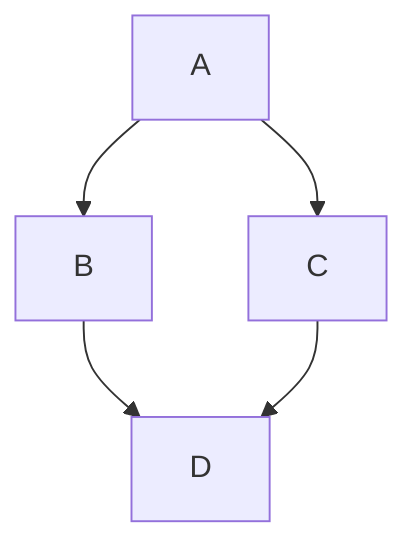

# VitePress Markdown 语法演示

## 基础功能

### 列表

**输入**

```
- 列表项1
- 列表项2
- 列表项3

1. 列表项1
2. 列表项2
3. 列表项3
```

**输出**

- 列表项1
- 列表项2
- 列表项3

1. 列表项1
2. 列表项2
3. 列表项3

::: tip 提示
除了 `-` 以外，还可以使用 `*` 或 `_` 来表示列表项，最终效果完全一致。
:::

### 引用

**输入**

```
> 消除恐惧的最好方法就是面对恐惧
```

**输出**

> 消除恐惧的最好方法就是面对恐惧

### 分割线

**输入**

```
---
```

**输出**

---

### 链接

分为内部和外部链接，且默认情况下，生成链接带有 .html后缀

**内部链接引用 -> 输入**

```
[点我跳转： markdown-examples 文章中的大纲](./markdown-examples.md#标题锚点)
```

**输出**

[点我跳转： markdown-examples 文章中的大纲](./markdown-examples.md#标题锚点)

**外部链接引用 -> 输入**

```
* [vuejs.org](https://vuejs.org/)

* [GitHub 上的 VitePress](https://github.com/vuejs/vitepress)
```

**输出**

* [vuejs.org](https://vuejs.org/)

* [GitHub 上的 VitePress](https://github.com/vuejs/vitepress)

### 图片

```
.
├─ docs
│  ├─ .vitepress
│  │  └─ config.mts
│  ├─ img
│  │  └─ ada.gif
│  │  └─ sekiro.png
│  ├─ public
│  │  └─ tifa.gif     
│  ├─ markdown-examples.md    <-- 我的位置
│  └─ index.md 
└─ package.json
```

::: warning 建议
更推荐使用相对路径：

- 可移植性：相对链接不依赖站点的根路径，文件移动后仍然能通过相对关系找到目标（配合 IDE 自动更新）。

- 预览友好：在 GitHub、VS Code 等环境中，相对链接可以正确跳转到源 Markdown 文件，而绝对链接会失效。

- 官方实践：VitePress 自身文档和大多数社区主题都采用相对链接。
:::

**输入**

```
<!-- 相对路径，图片文件相对于当前文章的所在位置 -->


<!-- 绝对路径，以 / 开头，此时定位于 /docs/ 目录下 -->

```

**输出**


::: warning 提示
由于 `public` 目录的特殊性，以 `/` 开头同时也等价于 `/docs/public/` ，可参考如下示例：
:::

**输入**

```

```

**输出**


### 视频

**输入**

::: tip 提示
目录规则与图片完全一致
:::

```
<video src="/demo.mp4" controls="controls"></video>
```

**输出**

<video src="/demo.mp4" controls="controls"></video>

此外，还可以使用容器快速嵌入不同平台的视频：

**输入**

```
::: video bilibili
BV11e411m7e8
:::
```

**输出**

::: video bilibili
BV11e411m7e8
:::

### 表格

**输入**

```
| Tables        |      Are      |  Cool |
| ------------- | :-----------: | ----: |
| col 3 is      | right-aligned | $1600 |
| col 2 is      |   centered    |   $12 |
| zebra stripes |   are neat    |    $1 |
```

**输出**

| Tables        |      Are      |  Cool |
| ------------- | :-----------: | ----: |
| col 3 is      | right-aligned | $1600 |
| col 2 is      |   centered    |   $12 |
| zebra stripes |   are neat    |    $1 |

### 待办列表

**输入**

```
- [ ] 吃饭
- [ ] 睡觉
- [x] 打豆豆
```

**输出**

- [ ] 吃饭
- [ ] 睡觉
- [x] 打豆豆

### Emoji <span class="emoji">🎉</span>

🐕 🚀 🪂 ⏳

Emoji大全：https://www.emojiall.com/zh-hans/

### 折叠

**输入**

```
<details>
  <summary>点我展开</summary>
  Markdown默认折叠语法，Vitepress可以使用容器折叠语法，更加美观
</details>
```

**输出**

<details>
  <summary>点我展开</summary>
  Markdown默认折叠语法，Vitepress可以使用容器折叠语法，更加美观
</details>

### 标题锚点

::: tip 提示
`[]` 中括号内文字随便输，`()` 括号里的填一个 `#` 号加标题

无论是几级标题，都是一个 `#` 号
:::

**输入**

```
[点我跳转：基础功能](#基础功能)
```

**输出**

[点我跳转：基础功能](#基础功能)

## 字体效果

### 字体加粗、倾斜、标红

**输入**

```
<span style="color: red;">**幸福**</span>就像你身后的***影子***，你追不到，但是<span style="color: red;">只要你往前走</span>，它<span style="color: red;">就会一直跟着你</span>。
```

**输出**

<span style="color: red;">**幸福**</span>就像你身后的***影子***，你追不到，但是<span style="color: red;">只要你往前走</span>，它<span style="color: red;">就会一直跟着你</span>。

### 删除线

**输入**

```
我变的~~越来越老~~越来越好了。
```

**输出**

我变的~~越来越老~~越来越好了。

### 下划线

**输入**

```
有时，<u>你必须进入别人的世界去发现自己的世界缺少什么</u>。
```

**输出**

有时，<u>你必须进入别人的世界去发现自己的世界缺少什么</u>。

## 容器

### 基本用法

**输入**

```
::: info
这是一条info，自定义格式：info+空格+自定义文字
:::

::: tip 提示
这是一个提示，自定义格式：tip+空格+自定义文字
:::

::: warning 警告
这是一条警告，自定义格式：warning+空格+自定义文字
:::

::: danger 危险
这是一个危险警告，自定义格式：danger+空格+自定义文字
:::

::: details 点我查看
这是一条详情，自定义格式：details+空格+自定义文字
:::
```

**输出**

::: info
这是一条info，自定义格式：info+空格+自定义文字
:::

::: tip 提示
这是一个提示，自定义格式：tip+空格+自定义文字
:::

::: warning 警告
这是一条警告，自定义格式：warning+空格+自定义文字
:::

::: danger 危险
这是一个危险警告，自定义格式：danger+空格+自定义文字
:::

::: details 点我查看
这是一条详情，自定义格式：details+空格+自定义文字
:::

### Badge 组件

**输入**

```
* VitePress <Badge type="info" text="default" />
* VitePress <Badge type="tip" text="^1.9.0" />
* VitePress <Badge type="warning" text="beta" />
* VitePress <Badge type="danger" text="caution" />
* VitePress <Badge type="warning" text="caution"> 自定义的警告信息 </Badge>
```

**输出**

* VitePress <Badge type="info" text="default" />
* VitePress <Badge type="tip" text="^1.9.0" />
* VitePress <Badge type="warning" text="beta" />
* VitePress <Badge type="danger" text="caution" />
* VitePress <Badge type="warning" text="caution"> 自定义的警告信息 </Badge>

## 代码行

**输入**

```
`console.log('Hello World!')`
```

**输出**

`console.log('Hello World!')`

## 代码块

### 行高亮

**输入**

````
```ts{2-3,5}
export default defineConfig({
  lang: 'zh-CN',
  title: "VitePress",
  description: "我的vitpress文档教程",
  titleTemplate: '另起标题覆盖title' ,
})
```
````

**输出**

```ts{2-3,5}
export default defineConfig({
  lang: 'zh-CN',
  title: "VitePress",
  description: "我的vitpress文档教程",
  titleTemplate: '另起标题覆盖title' ,
})
```

### 聚焦

**输入**

````
```js{4}
export default {
  data () {
    return {
      msg: 'Highlighted!' // [!code focus]
    }
  }
}
```
````

**输出**

```js{4}
export default {
  data () {
    return {
      msg: 'Highlighted!' // [!code focus]
    }
  }
}
```

### 增减差异

**输入**

````
```ts{4-5}
export default defineConfig({
  lang: 'zh-CN', 
  title: "VitePress", 
  description: "我的vitpress文档教程", // [!code --]
  description: "更详细的vitpress中文文档教程", // [!code ++]
  titleTemplate: '另起标题覆盖title' ,
})
```
````

**输出**

```ts{4-5}
export default defineConfig({
  lang: 'zh-CN', 
  title: "VitePress", 
  description: "我的vitpress文档教程", // [!code --]
  description: "更详细的vitpress中文文档教程", // [!code ++]
  titleTemplate: '另起标题覆盖title' ,
})
```

### 错误和警告

**输入**

````
```ts{4-5}
export default defineConfig({
  lang: 'zh-CN', 
  title: "VitePress", 
  description: "我的vitpress文档教程", // [!code error]
  description: "更详细的vitpress中文文档教程", // [!code warning]
  titleTemplate: '另起标题覆盖title' ,
})
```
````

**输出**

```ts{4-5}
export default defineConfig({
  lang: 'zh-CN', 
  title: "VitePress", 
  description: "我的vitpress文档教程", // [!code error]
  description: "更详细的vitpress中文文档教程", // [!code warning]
  titleTemplate: '另起标题覆盖title' ,
})
```

### 代码组

**输入**

````
::: code-group

```sh [pnpm]
# 查询pnpm版本
pnpm -v
```

```sh [yarn]
# 查询yarn版本
yarn -v
```

:::
````

**输出**

::: code-group

```sh [pnpm]
# 查询pnpm版本
pnpm -v
```

```sh [yarn]
# 查询yarn版本
yarn -v
```

:::

### 源码输出

**输入**

````
```
pnpm run docs:dev
```
````

**输出**

```
pnpm run docs:dev
```

## mermaid 流程图

### 流程图

**输入**

````

````

**输出**


### XY 坐标轴

**输入**

````

````

**输出**


### 更多

[mermaid 中文网](https://mermaid.nodejs.cn/intro/)

## 卡片

### 分享

**输入**

````
::: shareCard <每行显示数量 | auto>

```yaml
config:
  cardNum: 2 # 每行显示的卡片数量，默认为 auto，可在容器名字后面添加，如 ::: shareCard 3
  target: _blank # 跳转方式，默认为 _blank，仅支持 _blank | _self
  cardGap: 20 # 每行卡片之间的间隔，默认为 20
  showCode: false # 是否显示代码块，默认为 false

data:
  - name: 名称
    desc: 描述
    avatar: https://xxx.jpg # 头像，可选
    link: https://xxx/ # 链接，可选
    bgColor: "#CBEAFA" # 背景色，可选，默认 var(--vp-c-gray-1)。颜色值有 # 号时请添加引号
    textColor: "#6854A1" # 文本色，可选，默认 var(--vp-c-text-1)
```

:::
````

**输出**

::: shareCard

```yaml
config:
  cardNum: auto # 每行显示的卡片数量，默认为 auto，可在容器名字后面添加，如 ::: shareCard 3
  target: _blank # 跳转方式，默认为 _blank，仅支持 _blank | _self
  cardGap: 20 # 每行卡片之间的间隔，默认为 20
  showCode: false # 是否显示代码块，默认为 false

data:
  - name: slf
    desc: 这个人很懒，什么都没有留下...
    avatar: https://tse2-mm.cn.bing.net/th/id/OIP-C.jd5MmHmUaM0HEyAXjzc9nAHaHa?w=169&h=180&c=7&r=0&o=7&pid=1.7&rm=3 # 头像，可选
    link: https://xxx/ # 链接，可选
    bgColor: "#CBEAFA" # 背景色，可选，默认 var(--vp-c-gray-1)。颜色值有 # 号时请添加引号
    textColor: "#6854A1" # 文本色，可选，默认 var(--vp-c-text-1)
    
  - name: slf
    desc: 这个人很懒，什么都没有留下...
    avatar: https://tse2-mm.cn.bing.net/th/id/OIP-C.jd5MmHmUaM0HEyAXjzc9nAHaHa?w=169&h=180&c=7&r=0&o=7&pid=1.7&rm=3 # 头像，可选
    link: https://xxx/ # 链接，可选
    bgColor: "#CBEAFA" # 背景色，可选，默认 var(--vp-c-gray-1)。颜色值有 # 号时请添加引号
    textColor: "#6854A1" # 文本色，可选，默认 var(--vp-c-text-1)
```

:::

### 图文

**输入**

````
::: imgCard <每行显示数量 | auto>

```yaml
config:
  cardNum: 2 # 每行显示的卡片数量，默认为 auto，可在容器名字后面添加，如 ::: imgCard 3
  target: _blank # 跳转方式，默认为 _blank，仅支持 _blank | _self
  lineClamp: 2 # 显示描述信息的行数，默认为 2
  cardGap: 20 # 每行卡片之间的间隔，默认为 20
  imgHeight: auto # 图片宽度，默认为 auto。仅图文卡片支持该配置项
  objectFit: cover # 设置图片的填充方式，支持 cover | fill | contain | scale-down | none，默认为 cover
  showCode: false # 是否显示代码块，默认为 false

data:
  - img: https://abc.jpg # 图片地址
    link: https://abc.com # 链接地址
    name: 标题
    desc: 描述 # 可选
    author: 作者名称 # 可选
    avatar: https://abc.jpg # 作者头像，可选
```

:::
````

**输出**

::: imgCard auto

```yaml
config:
  cardNum: 2 # 每行显示的卡片数量，默认为 auto，可在容器名字后面添加，如 ::: imgCard 3
  target: _blank # 跳转方式，默认为 _blank，仅支持 _blank | _self
  lineClamp: 2 # 显示描述信息的行数，默认为 2
  cardGap: 20 # 每行卡片之间的间隔，默认为 20
  imgHeight: auto # 图片宽度，默认为 auto。仅图文卡片支持该配置项
  objectFit: cover # 设置图片的填充方式，支持 cover | fill | contain | scale-down | none，默认为 cover
  showCode: false # 是否显示代码块，默认为 false

data:
  - img: https://tse4-mm.cn.bing.net/th/id/OIP-C.R-lQJ6ZiYbzwGf7BxBoAUAHaEX?w=307&h=181&c=7&r=0&o=7&pid=1.7&rm=3 # 图片地址
    link: https://abc.com # 链接地址
    name: 标题
    desc: 描述 # 可选
    author: 作者名称 # 可选
    avatar: https://tse2-mm.cn.bing.net/th/id/OIP-C.jd5MmHmUaM0HEyAXjzc9nAHaHa?w=169&h=180&c=7&r=0&o=7&pid=1.7&rm=3 # 作者头像，可选
    
  - img: /tifa.gif # 图片地址
    link: https://abc.com # 链接地址
    name: 标题
    desc: 描述 # 可选
    author: 作者名称 # 可选
    avatar: https://tse2-mm.cn.bing.net/th/id/OIP-C.jd5MmHmUaM0HEyAXjzc9nAHaHa?w=169&h=180&c=7&r=0&o=7&pid=1.7&rm=3 # 作者头像，可选
```

:::

### 导航

**输入**

````
::: navCard <每行显示数量 | auto>

```yaml
config:
  cardNum: 2 # 每行显示的卡片数量，默认为 2，可在容器名字后面添加，如 ::: navCard 3
  target: _blank # 跳转方式，默认为 _blank，仅支持 _blank | _self
  lineClamp: 2 # 显示描述信息的行数，默认为 2
  cardGap: 20 # 每行卡片之间的间隔，默认为 20
  showCode: false # 是否显示代码块，默认为 false

data:
  - name: 标题
  desc: 描述
  link: 链接地址 # 可选
  img: 图片地址 # 可选
  badge: 徽章内容 # 可选
  badgeType: 徽章类型 # 可选
```

:::
````

**输出**

::: navCard auto

```yaml
config:
  cardNum: 2 # 每行显示的卡片数量，默认为 2，可在容器名字后面添加，如 ::: navCard 3
  target: _blank # 跳转方式，默认为 _blank，仅支持 _blank | _self
  lineClamp: 2 # 显示描述信息的行数，默认为 2
  cardGap: 20 # 每行卡片之间的间隔，默认为 20
  showCode: false # 是否显示代码块，默认为 false

data:
  - name: 百度
    desc: 百度——全球最大的中文搜索引擎及最大的中文网站，全球领先的人工智能公司
    link: http://www.baidu.com/
    img: https://www.baidu.com/favicon.ico
    badge: 搜索引擎
    
  - name: Google
    desc: 全球最大的搜索引擎公司
    link: http://www.google.com/
    img: https://ts1.cn.mm.bing.net/th/id/R-C.58c0f536ec073452434270fb559c3f8c?rik=SnOUNtUtPLX6ww&riu=http%3a%2f%2fwww.sz4a.cn%2fPublic%2fUploads%2fimage%2f20230303%2f1677839482835474.png&ehk=J1lqoeszPGEWzDOSZQ3JxzXsklfd0QzgrJu6ZVvESKk%3d&risl=&pid=ImgRaw&r=0
    badge: 搜索引擎
    badgeType: tip
```

:::

## More

点击查看[官方完整配置](https://vitepress.dev/zh/guide/markdown).

<ribbon />

<confetti />
