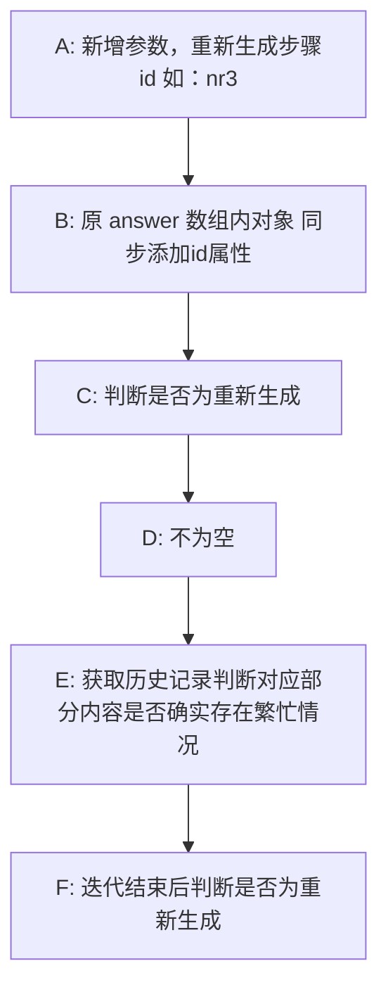

# dify

## 模型映射（待优化）

```js
const modelMap = {
  
}
```

## response 机构示例

```text
data: {"event": "workflow_started", "conversation_id": "7c2e1876-0d74-431d-af54-fe4c656123f0", "message_id": "fdc12b2e-9e55-4e2b-9755-93ec1d8a016c", "created_at": 1779953177, "task_id": "79554c24-4959-44c2-8e4f-f921ceceab1b", "workflow_run_id": "c8861e87-30de-44e2-b67c-d42daa341443", "data": {"id": "c8861e87-30de-44e2-b67c-d42daa341443", "workflow_id": "fc01953e-4a6e-47f0-b831-d6dc044d994d", "inputs": {"filename": null, "uid": "WEEvREcwSlJHSldTTEYyUFcrcTdNM1o0citMVUVOc0FIYUpzNWlwYndCQT0=$9A4hF_YAuvQ5obgVAqNKPCYcEjKensW4IQMovwHtwkF4VYPoHbKxJw!!", "sysid": "10", "flag": null, "expression": null, "sys.query": "人工智能驱动下我国情报研究热点与趋势", "sys.files": [], "sys.conversation_id": "7c2e1876-0d74-431d-af54-fe4c656123f0", "sys.user_id": "abc-123", "sys.dialogue_count": 0, "sys.app_id": "ea0a3d4d-3351-44f4-8e2d-143257f99067", "sys.workflow_id": "fc01953e-4a6e-47f0-b831-d6dc044d994d", "sys.workflow_run_id": "c8861e87-30de-44e2-b67c-d42daa341443"}, "created_at": 1779953182}}

data: {"event": "node_finished", "conversation_id": "7c2e1876-0d74-431d-af54-fe4c656123f0", "message_id": "fdc12b2e-9e55-4e2b-9755-93ec1d8a016c", "created_at": 1779953177, "task_id": "79554c24-4959-44c2-8e4f-f921ceceab1b", "workflow_run_id": "c8861e87-30de-44e2-b67c-d42daa341443", "data": {"id": "82330630-1d2c-4c83-a302-b5d1d983cff3", "node_id": "1762941251287", "node_type": "start", "title": "开始", "index": 1, "predecessor_node_id": null, "inputs": {"filename": null, "uid": "WEEvREcwSlJHSldTTEYyUFcrcTdNM1o0citMVUVOc0FIYUpzNWlwYndCQT0=$9A4hF_YAuvQ5obgVAqNKPCYcEjKensW4IQMovwHtwkF4VYPoHbKxJw!!", "sysid": "10", "flag": null, "expression": null, "sys.query": "人工智能驱动下我国情报研究热点与趋势", "sys.files": [], "sys.conversation_id": "7c2e1876-0d74-431d-af54-fe4c656123f0", "sys.user_id": "abc-123", "sys.dialogue_count": 0, "sys.app_id": "ea0a3d4d-3351-44f4-8e2d-143257f99067", "sys.workflow_id": "fc01953e-4a6e-47f0-b831-d6dc044d994d", "sys.workflow_run_id": "c8861e87-30de-44e2-b67c-d42daa341443"}, "process_data": null, "outputs": {"filename": null, "uid": "WEEvREcwSlJHSldTTEYyUFcrcTdNM1o0citMVUVOc0FIYUpzNWlwYndCQT0=$9A4hF_YAuvQ5obgVAqNKPCYcEjKensW4IQMovwHtwkF4VYPoHbKxJw!!", "sysid": "10", "flag": null, "expression": null, "sys.query": "人工智能驱动下我国情报研究热点与趋势", "sys.files": [], "sys.conversation_id": "7c2e1876-0d74-431d-af54-fe4c656123f0", "sys.user_id": "abc-123", "sys.dialogue_count": 0, "sys.app_id": "ea0a3d4d-3351-44f4-8e2d-143257f99067", "sys.workflow_id": "fc01953e-4a6e-47f0-b831-d6dc044d994d", "sys.workflow_run_id": "c8861e87-30de-44e2-b67c-d42daa341443"}, "status": "succeeded", "error": null, "elapsed_time": 0.099964, "execution_metadata": {}, "created_at": 1779953182, "finished_at": 1779953182, "files": [], "parallel_id": null, "parallel_start_node_id": null, "parent_parallel_id": null, "parent_parallel_start_node_id": null, "iteration_id": null, "loop_id": null}}

event: ping

data: {"event": "message", "conversation_id": "7c2e1876-0d74-431d-af54-fe4c656123f0", "message_id": "fdc12b2e-9e55-4e2b-9755-93ec1d8a016c", "created_at": 1779953177, "task_id": "79554c24-4959-44c2-8e4f-f921ceceab1b", "id": "fdc12b2e-9e55-4e2b-9755-93ec1d8a016c", "answer": "<div class="containerbox_btn"><span>规划与思考</span><a class="">></a></div>", "from_variable_selector": ["1773824936788", "content"]}

xxx
```

## 导入后续步骤（dify 端 `文献计量分析` 跨环境同步步骤）

- 历史记录首尾工具、工具结果读取、参数替换更新
- 搜索 `无数据提示`，替换工具及结果读取

## 重新生成功能实现

### 流程预定义



补充说明：

- A：start 节点
- B：（在统一异常拦截处添加上id：nr x 和 表示异常状态的属性 如： code：500，在answer 整理时到底有没有必要也加上id？如果加所有的都要加。否则前端如何识别 id 与 h 标签的对应关系？或者直接传 h 标签文字，然后判断配置文件中是否包含）
- C：即 id 是否不为空
- D：进入重新生成逻辑，返回单节点数组进入迭代
- E：
- F：若是则本次的 answer 数组只有当前重新生成 id 对应的节点部分，然后与原完整历史根据 id 进行内容合并，最后更新历史

开始给前端之前要提供一个 reGeneratePosition，不对，迭代内会输出 prev （标题的那种，如"\n\n### （二） 区域发文分析\n\n"），前端读到这个可以 === 替换掉数组内对应位置

### 前端需要适配

1. 那现在读取历史时要判断读最新的一条
2. 标题右侧按条件决定是否展示“重新生成”按钮
3. 点击发起请求，额外参数 h 标题文字 （dify会根据判断是否存在大纲内）
4. 读取时，若为重新生成，则先移除原 answer 数组内的对应部分（根据 h 标题文字匹配），然后在此处插入流内容
5. error_handler todo

### 决策点

1. ~~当存在多个异常时，是否要考虑  一键重新生成所有异常（也就是对应传的id 参数调整为数组，偏向不考虑）？~~
2. ~~存储历史记录多条是否合理？是否需要删除原记录？否则报告本身长度就很长了是否会超出长度？与陈昕确认~~
3. ~~检查 `dify` 全流程是否还存在除 `结论` 外的数据依赖性节点~~

### 注意点

2. 前端如何定位重新生成的内容属于哪里？ 替换 \n 然后 trim 不等空 然后 等于 answer 数组的某个 以 # 开头的的content 值 即代表匹配，然后到下一个 # 开头的之间的全部给替换掉
3. 那么，echarts 节点呢？
4. dify 端哪里需要判断是否为重新生成？ ✔

## 开发记录（日报备忘录 + dify 发版缓冲区）

## 缓冲区

```js

```

剩余问题

1. 生成后历史中的日期没了 -> 目前存在的问题是重新生成时日期会隐藏 ✔
2. 合并后部分内容丢失了 （已定位根源在 dify 历史合并节点，问题1可能与2原因相同）✔
3. 重新生成后，echart图过渡无法正常结束以及位置错误 ✔
4. 首次生成后，关系图重新生成后，过渡动画未正确关闭 ✔
5. 首次生成后，点重新生成后即使结束后，操作栏也没出现
6. 聚类图没出来 ✔
7. （一） 发文趋势分析 缺少内容 
8. 重新生成后对应的会话跑到列表最上方了
9. 偶尔导出docx后，使用2016打开提示遇到错误


分析近五年人工智能在医疗领域的研究热点和演变趋势。

## 前端结构梳理

1. 渲染结构

### index

```js
{
  type: '' // undefied 视作 markdown ，如果在定义的 echarts 图表列表里就按 if 渲染
  renderType: undefined // undefined == markdown | echarts
}
```

### history

```js
{
  type: 'markdown' // markdown | echarts
  renderType: 'pie' // 当 type 为 echarts 时
}
```


## 提示词模板

```text
你是一名专业的【任务角色，如“情感分析专家”“信息提取引擎”等】。  
你的任务是基于给定的输入，严格按照要求完成【任务描述，如“情感分类”“实体抽取”】，并仅输出符合格式的结果。

【可选：补充背景知识或特殊判定规则，如无则删除此行】

输入文本：
{待处理文本}

要求：
1. 【具体规则1，例如：判断情感类别为“积极”“消极”“中立”之一】
2. 【具体规则2，例如：提供不超过50字的简要理由】
3. 【格式约束】最终输出必须是一个合法的 JSON 对象，不包含任何额外文字、注释或 Markdown 代码块标记。  
4. 【稳定性约束】如果输入信息不足或无法判断，请将对应字段置为 null，但依然保持 JSON 结构完整。

输出 JSON 格式如下（严格遵循字段名与类型）：
{
  "field1": "类型说明",
  "field2": "类型说明",
  "field3": "类型说明"
}

## 示例
示例1：
输入：“马克·扎克伯格是Facebook的创始人”
输出：{"person": "马克·扎克伯格", "occupation": "企业家", "company": "Facebook"}

示例2：
输入：“屠呦呦因发现青蒿素获得诺贝尔奖”
输出：{"person": "屠呦呦", "occupation": "科学家", "achievement": "发现青蒿素"}

【按需增删示例，确保覆盖边界情况，如输入模糊时的兜底输出】
```

<ribbon />
